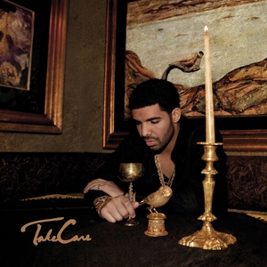
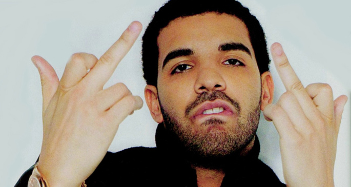

```{r setup, include=FALSE}
knitr::opts_chunk$set(echo = TRUE, message=FALSE, warning=FALSE)
library(tidyverse)
library(stringr)
```

```{r lexicoder-func, echo=FALSE}
lex <- function(f, dat="data", md=NULL, sd=NULL, kw=NULL, win=NULL, files=NULL, out="temp.tab"){
  require(tidyverse)
  require(stringr)
  
  if (is.null(dat) | is.null(f)){
    message("Must provide values for f and dat")
    return (NULL)
  }
  cmd <- str_c("java -jar Lexicoder.jar ", f, " ", "dat=", dat)
  if(!is.null(md)) cmd <- str_c(cmd, " md=", md)
  if(!is.null(sd)) cmd <- str_c(cmd, " sd=", sd)
  if(!is.null(kw)) cmd <- str_c(cmd, " kw=", kw)
  if(!is.null(win)) cmd <- str_c(cmd, " win=", win)
  if(!is.null(files)) cmd <- str_c(cmd, " files=", files)
  cmd <- str_c(cmd,">",out,sep=" ")
  
  # Displays the actual Lexicoder call
  message(cmd)
  system(cmd)
  
  # Reads the temp file in so it can be returned 
  df <- read_delim(out, "\t")
}

```

```{r lexicoder, echo=FALSE}
wc <- lex("wc")
sent <- lex("dc",md="LSD2015.lc3")
drake_songs <- wc %>% left_join(sent, by="case") %>% left_join(read_delim("albums.tab", "\t"), by="case")
drake_songs$sentiment <- drake_songs$positive-drake_songs$negative
drake_songs$sent_percent <- drake_songs$sentiment/drake_songs$wordcount
drake_songs$date_name <- paste(drake_songs$year, drake_songs$album, sep=" - ") 

# Drop the songs from the EP
drake_songs<-filter(drake_songs, album!="So Far Gone EP")

# Drop songs not on an album
drake_songs<-filter(drake_songs, album!="Other")


```

## You used to, you used to...
With all the crazy shit that's going on in the world, it's no surprise that I often wake up in the middle of the night worried. Like any normal person, I'll sometimes rise at 3am, sit up in bed, feel momentarily burdened by the silence of the slumbering city, and then whisper a question to an unseen force in the darkness: *"...Do you think Drake is okay?"*

<center>

</center>
<br/><br/>
And now with a new [album/mixtape/play list](https://open.spotify.com/album/1lXY618HWkwYKJWBRYR4MK) out, well, we might be able to get another little glimpse into his sad, sad, overstuffed box of feelings that he carries around with him like an empty gold chalice. With a bit of R and [Lexicoder](http://www.lexicoder.com/) and some web scraping of [azlyrics.com](http://azlyrics.com/d/drake.html), maybe we can start wrestling with some important questions. 

Questions like: *Seriously Drake, are you okay*?

I mean, it's completely reasonable to think that maybe the weight of the world is getting Drake down - and if so, we should probably be able to see that in his lyrics.  Are they getting sadder? What about the number of sad songs per album? Is that ratio increasing?  

<br/><br/>
<br/>
## Drake's Saddest Songs
```{r sad-song, echo=FALSE}
a<- filter(drake_songs, sentiment==min(drake_songs$sentiment))
```
One thing that is for sure, if Drake's got enemies - I mean got a *lot of enemies* - they're not draining him of any energy.  I collected 275 songs from [azlyrics.com](http://azlyrics.com/d/drake.html), 191 of them were on albums and got included in the analysis here. So which one of Drake's songs is the saddest?  Well, using the [Lexicoder Sentiment Dictionary](http://www.lexicoder.com/), it would appear that that most *negative* song is: **"Digital Dash"** from *"What a Time To Be Alive."* 

A quick note on methods, all we are doing here is running a dictionary of negative and positive sentiment scores against a cleaned up dataset of Drake's lyrics. The overall sentiment score is just the difference between negative and positive word counts. We can then plot those over time, by album, or look at other measures if we'd like. 

With a sentiment score of `r a$sentiment`, it is a clear outlier (the average sentiment score for drake songs is `r mean(drake_songs$sentiment)`, and the average score for this albums is `r mean(filter(drake_songs, album=="What A Time To Be Alive")$sentiment)`).  It's not clear if this is the *saddest* song in Drake's album catalogue, but it's definitely one of the **darkest**.  


```{r remove-outliers, echo=FALSE}
drake_songs <- filter(drake_songs, sentiment > -20 & sentiment < 20)
```

```{r sad-song-2, echo=FALSE}
a<- filter(drake_songs, sentiment==min(drake_songs$sentiment))

# Now let's get some info on the count of songs per album
drake_songs$positive_song[drake_songs$sentiment < 0] <- "Negative Songs" 
drake_songs$positive_song[drake_songs$sentiment >= 0] <- "Positive Songs" 
#drake_songs$net_songs <- drake_songs[drake_songs$sentiment >= 0]-drake_songs[drake_songs$sentiment < 0]

drake_songs$negative_song[drake_songs$sentiment < 0] <- 1 
drake_songs$negative_song[drake_songs$sentiment >= 0] <- 0 

```

Happily, it looks like Drake's been getting happier as his career has gone on (average sentiment overlaid below).  I would love to plot these scores against his album sales... so maybe that's a next step.

<center>
```{r sad-albums, echo=FALSE}
ggplot(drake_songs) + geom_point(mapping=aes(x=date_name, y=sentiment), size=1, position=position_jitter(width=0.3, height=0))+ scale_x_discrete(name="Album") + scale_y_continuous(name="Sentiment") + theme(axis.text.x = element_text(angle = 90, hjust = 1)) + geom_abline(show.legend = TRUE)
```
</center>


It's probably wise to drop the outliers - both the positive and negative, since this track is so far out there, and let's face it, Drake has a tendancy do things real big, bigger than you ever done it. When we drop the outliers , it looks like the saddest/darkest songs in Drake's catalog are **"Own It"** off *"Nothing Was The Same"*, and **"Say What's Real"** off of *"So Far Gone"*, both with a sentiment score of `r a$sentiment[1]`.
<br/><br/>
<br/>

## Drake's Saddest Albums

This doesn't quite tell us the full story though.  When we look at overall sentiment per ablum, we can see that Drake ... well... it seems like Drake wasn't in a very good place for a few years.
<br/><br/>
<center>
```{r sad-albums-2, echo=FALSE}
ggplot(drake_songs) + geom_bar(mapping=aes(x=date_name, y=sentiment), stat="summary") + scale_x_discrete(name="Album") + scale_y_continuous(name="Sentiment") + theme(axis.text.x = element_text(angle = 90, hjust = 1)) 
```
</center>

<table><tr><td>Album<td>Negative Songs<td>Positive Songs<td>Difference</tr>
<tr><td>2006 - Room for Improvement<td>3<td>11<td>8</tr>
<tr><td>2007 - Comeback Season<td>5<td>15<td>10</tr>
<tr><td>2009 - So Far Gone<td>4<td>12<td>8</tr>
<tr><td>2010 - Thank Me Later<td>0<td>11<td>11</tr>
<tr><td>2010 - Young Sweet Jones<td>1<td>10<td>9</tr>
<tr><td>2011 - Take Care<td>10<td>10<td>0</tr>
<tr><td>2013 - Nothing was the Same<td>6<td>8<td>2</tr>
<tr><td>2015 - If You're Reading This It's Too Late<td>9<td>9<td>0</tr>
<tr><td>2015 - What A Time To Be Alive<td>4<td>5<td>1</tr>
<tr><td>2016 - Views<td>0<td>12<td>12</tr>
<tr><td>2017 - More Life<td>6<td>14<td>8</tr>
</table>


But by the time *Views* was released, he seemed to have gotten things under control.  And *Views* was extremely positive. Like off the charts positive. Perhaps Drake was too strung out on compliments, and he overdosed on confidence, because his follow up is back down to the levels of *Take Care*.  Are we about to enter another Drake slump? Will his next album be another dark pit of depression, introspection, and sadness, or is this just a momentary blip?  Only time will tell.
<br/><br/>
<br/>

## Conclusions
Of course this is a first cut, and you'll note that I haven't actually looked at the lyrics at all to see if this can be confirmed. It'd be great to have someone who *really knows* his catalog to help sort through this. But from my knowledge of Drake's catalog, this seems pretty accurate.

Tentative conclusion: Drake's probably doing just fine, but this could be the beginning of another exploration of the darker sides of his psyche.  Not particularly surprising for someone who started at the bottom, but really, I think I like who he's becoming.
<br/><br/>
<br/>

## Postscript
On a whim, I just checked to see what the most common words were in the dataset.  What was the most common word that Drake says in his music?
<center>

</center>
<br />
That word is *"I"*

---
I'm on twitter @[markdaku](http://www.twitter.com/markdaku)
